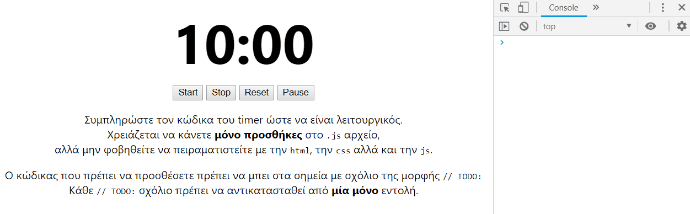

# Countdown Timer

Συμπληρώστε τον κώδικα του timer ώστε να είναι λειτουργικός. Χρειάζεται να κάνετε **μόνο προσθήκες** στο `.js` αρχείο, αλλά μην φοβηθείτε να πειραματιστείτε με την `html`, την `css` αλλά και την `js`.

Ο κώδικας που πρέπει να προσθέσετε πρέπει να μπει στα σημεία με σχόλιο της μορφής `// TODO:`

Κάθε `// TODO:` σχόλιο πρέπει να αντικατασταθεί από **μία μόνο** εντολή.

**ΣΗΜΕΙΩΣΗ**: Μελετήστε τον υπάρχων κώδικα, χωρίς να σπαταλήσετε πολύ χρόνο. Θα σας βοηθήσει ο κώδικας της συνάρτησης `init`.

## Επιθυμητό αποτέλεσμα:

